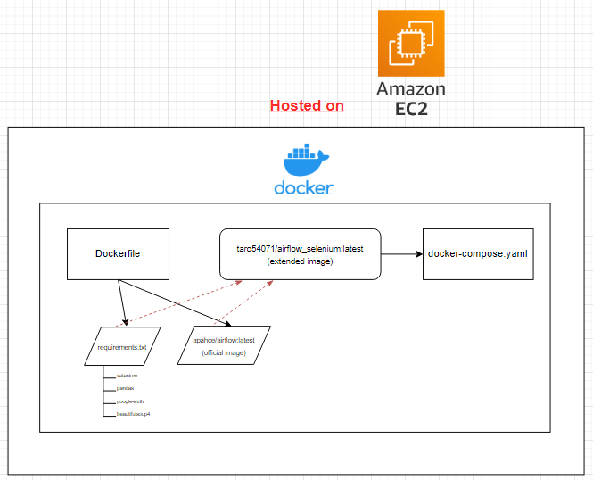
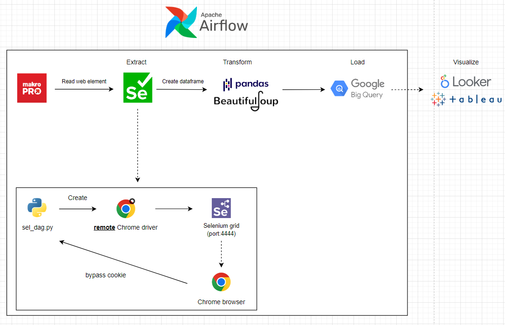

# Scenario

มีลูกค้า retail(makro, lotus, tops) ต้องการที่จะ track ราคาสินค้าประเภทเครื่องดื่มทั้งหมด

## Miscellany

ec2-user@ec2-52-66-69-75.ap-south-1.compute.amazonaws.com

http://52.66.69.75:8080/

## Objective

- สร้าง dashboard แสดงผลราคาของทุก Product โดยมีรายละเอียดดังนี้
  - brand
  - product name
  - product price
  - timestamp
- จะต้องมีการอัพเดตราคาแบบ every 5 mins on weekday
- (opt.) filter ชื่อสินค้า or ราคาสินค้าใน dashboard

## Tools

- Selenium
- BeautifulSoup4
- Pandas
- Google Bigquery
- Airflow
- Looker studio

## Workflow

### 1. Setting up required tools

### 2. Pipeline

## ปัญหาที่เจอ

- docker network: ทุกครั้งที่ docker compose up network ของ container จะเปลี่ยนไป

## dashboard
- [looker](https://lookerstudio.google.com/reporting/3974e62b-664d-4792-91e8-67e6aeb3df5c)

## Reference

- [Connect GoogleBQ to Tableau with JDBC connectoin driver](https://help.tableau.com/current/pro/desktop/en-us/examples_googlebigquery_jdbc.htm)
- [Web Scraping with Selenium and Python in 2023](https://www.zenrows.com/blog/selenium-python-web-scraping#finding-elements-and-content)
- [Dynamic Web Pages Scraping with Python: Guide to Scrape All Content](https://www.zenrows.com/blog/dynamic-web-pages-scraping-python#what-is)
- [Selenium testing without browser](https://stackoverflow.com/questions/7593611/selenium-testing-without-browser)
- [Concatenate a list of pandas dataframes together](https://stackoverflow.com/questions/32444138/concatenate-a-list-of-pandas-dataframes-together)
- [Find elements by class using beautifulsoup](https://www.codespeedy.com/find-elements-by-class-using-beautifulsoup/#google_vignette)
- [Beautifulsoup documentation](https://www.crummy.com/software/BeautifulSoup/bs4/doc/)
- [Running headless chrome driver in selenium](https://www.selenium.dev/blog/2023/headless-is-going-away/)
- [Airflow docker install python packages: Airflow Tutorial](https://www.youtube.com/watch?v=0UepvC9X4HY)
- [selenium/standalone chrome](https://hub.docker.com/r/selenium/standalone-chrome)
- [Using OAuth 2.0 for Server to Server Applications](https://developers.google.com/identity/protocols/oauth2/service-account#python)
- [Parallel Execution of Tests using Selenium Grid 4 with Docker Compose](https://medium.com/@iamfaisalkhatri/parallel-execution-of-tests-using-selenium-grid-4-with-docker-compose-2dc243f4fe8b)
